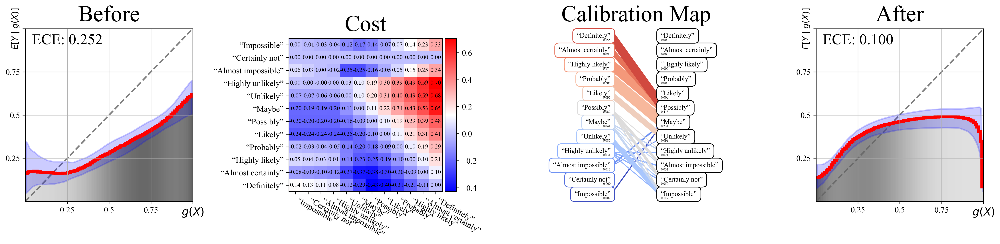

# [ICLR'25] Calibrate Expressions of Certainty


[arXiv](https://arxiv.org/abs/2410.04315) | [OpenReview](https://openreview.net/forum?id=dNunnVB4W6) | [Poster](https://people.csail.mit.edu/wpq/data/poster_iclr2025.pdf) | [MIT News](https://news.mit.edu/2025/new-method-assesses-and-improves-reliability-radiologists-diagnostic-reports-0404) | [Spotify](https://spotifycreators-web.app.link/e/aZZ0f7UfOSb)


Radiologists often use phrases like "possible pneumonia" or "likely infection" when interpreting medical images. The usage of these expressions of certainty directly influence patient care, e.g., from ordering follow-up scans versus initiating treatments right away. 

But how well do these expressions actually align with the real-world likelihood of events?

In this work, we introduce a framework to measure and improve the calibration of linguistic expressions of certainty—that is, to evaluate whether terms like "likely" or "possibly" match the actual probabilities of outcomes and provide interpretable suggestions to help align language with observed reality.

This framework not only supports more reliable communication in clinical settings, but also offers a way to assess and improve the calibration of language models that express their confidence in natural language.


# Quick Install


```sh
# clone repo
git clone https://github.com/tt6746690/calibrate_expressions_of_certainty.git
cd calibrate_expressions_of_certainty

# setup up conda env
conda env create -f env.yml

# Intall dependencies
pip install torch==2.2.2 torchvision==0.17.2
pip install jupyterlab "numpy<2" pandas scipy scikit-learn matplotlib omegaconf tabulate
pip install transformers accelerate datasets evaluate sentencepiece
pip install POT --no-deps # too many extra deps not needed.
pip install openai anthropic google-generativeai

# Install current package
pip install -e .
```


# Tutorial

Once you've set up the codebase and environment, we recommend going through the code in [tutorial.ipynb](https://github.com/tt6746690/calibrate_expressions_of_certainty/blob/main/tutorial.ipynb). It walks through how to:
- Measure the calibration of GPT-4o when it expresses confidence using natural language—e.g., phrases like "likely" or "possibly"—in response to questions from TruthfulQA.
- Improve GPT-4o’s calibration by adjusting its use of these certainty phrases.

By following the tutorial, you’ll gain a clearer understanding of the codebase and learn how to visualize model calibration using reliability diagrams, as well as interpret the resulting calibration map, as shown below:




# Citation

```bibtex
@inproceedings{wang2024calibrating,
    title={Calibrating Expressions of Certainty},
    author={Wang, Peiqi and Lam, Barbara D. and Liu, Yingcheng and Asgari-Targhi, Ameneh and Panda, Rameswar and Wells, William M. and Kapur, Tina and Golland, Polina},
    booktitle={International Conference on Learning Representations (ICLR)},
    year={2025},
}
```

